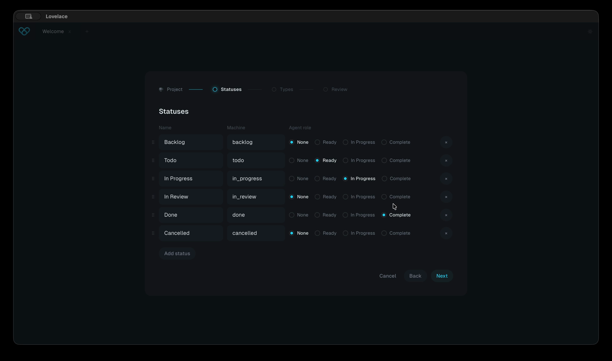

# Lovelace

Local-first project management for software teams that build with AI coding agents. Tickets, documentation, architecture decisions and agent session history live as plain Markdown files in a `.lovelace/` directory inside your repository, and Lovelace is the desktop app that runs them: macOS, Linux and Windows, with no server, no database, no account and no cloud.

[](.github/lovelace-demo.mp4)

**[Watch the demo](.github/lovelace-demo.mp4)** (45 seconds): initialise a project, define your own statuses, create a ticket, browse the documentation tree and the link graph.

This repository is its own proof. Lovelace manages the development of Lovelace: the 139 tickets, 144 agent session records and 12 architecture decision records behind the app sit in [`.lovelace/`](.lovelace) at the root of this repo, written by the same tools that ship in the download. When a Claude Code session works on this codebase it reads its orientation from those files, works a ticket, and writes a session record before it finishes. Git carries the whole history, so you can read every decision that led here.

## Why local files

Coding agents already live in the filesystem and in Git. Putting tickets, documents and session history where the agents already are gives them full project context natively, with Git as the audit trail. The files are the source of truth; everything else (indexes, boards, digests) is derived from them and can be regenerated at any time. What Obsidian is to Notion, Lovelace is to Jira and Linear.

## How it works

Everything a project knows lives in `.lovelace/` at the root of your repository:

```
.lovelace/
  manifest.yaml            project identity and spec version
  schema.yaml              ticket types (with their fields), statuses, priorities
  actors.yaml              the user plus named agent identities
  board-order.yaml         optional; manual per-column card order
  AGENTS.md                agent operating instructions, installed and
                           regenerated by the agent integration
  documentation/           nested knowledge tree; index.md is where an
                           agent starts reading (a convention, not required)
    architecture/
      decisions/           ADRs
  tickets/                 flat; one file per ticket, e.g. T-0142.md
  comments/
    <ticket-id>/           one timestamped file per comment
  sessions/                one file per agent session, e.g. S-0031.md
  templates/               scaffolds for new tickets, ADRs and sessions
  state/                   gitignored; active ticket, presence, counters
  index/
    index.json             generated, gitignored
    BOARD.md               generated, committed
```

The rules that hold everywhere:

- One entity per file. Comments and session records are append-only sibling files.
- Hand-edited files are a supported path. Malformed input produces a clear validation error pointing at file and line, never a crash and never silent repair.
- Ticket fields are data, not code. Each ticket type defines its own fields in `schema.yaml`; the validator, indexer, MCP server and the app's forms all read those definitions at runtime. Only five core fields are locked: `id`, `type`, `status`, `created`, `updated`.
- The index is derived and deterministic. Running the indexer twice on unchanged input produces byte-identical output.
- Round-trip fidelity is an acceptance bar. Opening and saving a file without edits is byte-identical; edits produce minimal diffs.
- The format is versioned (currently spec 3.2.0). Tooling refuses major versions it does not understand and offers a migration for older projects.

The complete on-disk format is specified in [SPEC.md](SPEC.md), written so a developer can create a valid `.lovelace/` directory by hand using only that document. [BRIEF.md](BRIEF.md) describes what is being built and in what order.

## Using Lovelace

### Initialising a project

Open the app and point it at a directory. A directory without `.lovelace/` is offered an initialisation wizard, which works for both a brand-new project and an existing repository. It scaffolds the manifest, a default schema, actors, templates and the documentation tree, adds the gitignored paths to `.gitignore`, and can install the agent integration. Multiple projects can be open simultaneously, one per tab.

### Working in the app

- **Board.** Tickets grouped by status, columns from `schema.yaml`. Drag cards between columns to change status; card order within a column is yours and persists in `board-order.yaml`.
- **List.** Tickets grouped by status in a flat list, with filtering and bulk actions.
- **Ticket detail.** Every field is rendered from the schema definitions at runtime, so user-defined fields appear automatically with the right input per type. Bodies are edited in a block editor that compiles to Markdown with round-trip fidelity. Comments, session records and commits display in a timeline.
- **Documents.** The `documentation/` hierarchy as a navigable tree, with `index.md` as a directory's landing page and stale documents (past their `review_by` date) badged.
- **Graph.** The wiki-link graph across tickets and documents, with manual node positions saved locally.
- **Settings.** Edit ticket types, fields, statuses, priorities and actors through generated forms; everything writes back to the YAML files through core validation.

The app runs a file watcher: external edits (an agent writing while you read) re-validate, re-index and surface in the UI live. All mutations route through core validation, so the app can never produce a file the validator rejects.

### Working with agents

Claude Code is the agent integration in v1. The init flow installs:

- A project-scoped `.mcp.json` registering the bundled MCP server (stdio transport).
- A pointer section in `CLAUDE.md` that directs the agent to `.lovelace/AGENTS.md`, a Lovelace-owned, regenerated file holding the rules of engagement.
- Hooks in `.claude/settings.json`: a session-start digest that orients the agent, a stop check that ensures a session record was written, a guard that blocks direct edits to ticket files, and presence tracking so the app shows live agent activity.
- Slash commands (`/ticket <id>`, `/done`) and an opt-in `prepare-commit-msg` Git hook that injects the active ticket ID into commit messages.

The MCP server exposes exactly eight tools:

| Tool | Purpose |
|---|---|
| `create_ticket` | Validates fields against the schema, assigns an ID, writes the file |
| `update_ticket` | Updates fields and status; rejects edits to locked core fields |
| `describe_schema` | Returns the project's types, fields, statuses and priorities |
| `query_tickets` | Filters by status, type, assignee, parent or any defined field |
| `read_document` | Returns a document's body, or a directory's landing page plus child summaries |
| `log_session` | Writes an append-only session record |
| `set_active_ticket` | Records the ticket the session is working on |
| `search` | Plain text search across entity bodies and titles |

Every mutation triggers a re-index. A fresh agent session starts oriented: the digest hook injects in-progress tickets, recent session records and validation warnings, all under roughly 1,500 tokens.

## Installation

### For users

Download the installer for your platform from [lovelace.co](https://lovelace.co). macOS gets `.app` and `.dmg`, Windows `.msi` and `.exe`, Linux `.deb`, `.rpm` and `.AppImage`. The app auto-updates via the Tauri updater; the update check is the only network call the app ever makes. No telemetry.

### Building from source

Prerequisites:

- Node 22 or later
- pnpm 10 (`corepack enable` or `npm install -g pnpm`)
- The Rust toolchain (for the Tauri shell and to resolve the target triple)
- Bun (to compile the sidecar binaries)
- Tauri platform dependencies: Xcode command line tools on macOS, WebView2 on Windows, `webkit2gtk` and friends on Linux (see the Tauri v2 prerequisites guide)

Then:

```sh
pnpm install
pnpm build        # type-checks and builds every package
pnpm test         # full test suite
```

To run the app in development:

```sh
pnpm app:dev
```

Development runs against `packages/mcp/dist/host.js` directly (via `LOVELACE_HOST_JS`), so a plain `pnpm build` is enough to pick up host changes.

To produce a packaged production build, compile the sidecars first or the app ships stale ones:

```sh
pnpm sidecars     # Bun-compiles host, agent and MCP binaries into src-tauri/binaries/
pnpm app:build    # installers land under apps/desktop/src-tauri/target/release/bundle/
```

The compiled sidecar binaries are not tracked in the repository; `pnpm sidecars` produces them locally and the release pipeline compiles them fresh per platform. The full release process (signing, notarisation, update artifacts, `latest.json`) is documented in [docs/RELEASING.md](docs/RELEASING.md).

## Repository structure

A pnpm workspace monorepo. Node 22 for development, TypeScript strict mode throughout.

```
apps/
  desktop/         the Tauri app (Rust shell, React frontend)
packages/
  core/            parsing, schemas, validation, indexing, digest, mutations
  mcp/             the MCP server, the agent helper and the core host
examples/
  demo-project/    the canonical fixture; tests run against it
docs/              releasing guide, design system, tone and language
scripts/release/   assembles latest.json from signed release artifacts
SPEC.md            the on-disk format specification
BRIEF.md           what is being built and in what order
```

### packages/core

Pure logic, no UI surface and no process-level IO assumptions. Everything else calls into it. The main modules:

- `frontmatter.ts`, `config.ts`, `fields.ts`: parse entity frontmatter and the YAML configuration files; validate ticket fields against runtime schema definitions.
- `project.ts`, `validate.ts`: load a whole project and validate it, with errors carrying file and line. Errors and warnings are distinct; warnings never block.
- `index-gen.ts`, `links.ts`, `order.ts`: build the deterministic `index.json` (including the wiki-link graph) and the committed `BOARD.md`; manage manual board ordering.
- `digest.ts`: the compact orientation summary injected at agent session start.
- `mutate.ts`, `ids.ts`: create and update tickets, log sessions, add comments, track the active ticket and agent presence. ID assignment is atomic via counter files under an exclusive lock.
- `init.ts`, `schema-config.ts`: scaffold a new `.lovelace/` directory and the default schema.
- `search.ts`, `watch.ts`, `graph-layout.ts`: plain text search, the debounced re-validate and re-index watch layer, and saved graph node positions.
- `version.ts`, `migrations/`: spec version classification and project migrations across major versions.

### packages/mcp

The three agent-facing processes, all shipped as self-contained Bun-compiled sidecar binaries bundled with the app:

- `server.ts` (`lovelace-mcp`): the MCP server, built on the official TypeScript MCP SDK over stdio, exposing the eight tools above.
- `helper.ts` (`lovelace-agent`): the headless helper Claude Code hooks invoke: print the digest, check for a session record at stop, guard ticket writes, and maintain per-session presence and active-ticket markers. Errors go to stderr, data to stdout.
- `host.ts` (`lovelace-host`): a stateless bridge between the desktop app's Rust shell and `packages/core`. One JSON request in, one JSON response out, then the process exits; the app spawns it per operation.
- `claude.ts`: generates and maintains the Claude Code assets (CLAUDE.md section, `.lovelace/AGENTS.md`, hooks, slash commands, `.mcp.json`).

### apps/desktop

The Tauri app. It reads and writes only through `packages/core` (via the host sidecar); there is no private store, so closing the app loses nothing.

- `src/views/`: Welcome, Board, List, TicketDetail, Documents, Graph and Settings.
- `src/components/`: the init wizard, schema editors, generated field inputs, search palette, dialogs and shared pieces.
- `src/editor/`: the Lexical-based block editor with Markdown round-trip conversion, wiki-link and verbatim nodes, slash menu and drag handles.
- `src/lib/`: host IPC, formatting and display-name resolvers, date and time via the OS locale, links, presence, and platform helpers.
- `src/state/`: the application store and theming.
- `src/styles/`: the design tokens (`tokens.css`) and application styles. The visual language is documented in `docs/design/lovelace-design-system.md`.
- `src-tauri/`: the Rust shell, Tauri configuration and capabilities. Sidecar binaries are compiled into `src-tauri/binaries/` by `pnpm sidecars` and are not tracked.

### examples/demo-project

The canonical fixture: a fictional weather API whose `.lovelace/` directory exercises every entity type in the spec, including custom fields owned per ticket type. Tests across the monorepo run against it and against deliberately corrupted variants of it. It must stay valid at all times; a spec change updates the fixture and SPEC.md in the same commit.

## Development

```sh
pnpm build             # type-check and build every package
pnpm test              # run the full vitest suite
pnpm watch:packages    # rebuild core and mcp on change
pnpm app:dev           # run the desktop app against the built host
pnpm sidecars          # compile sidecar binaries for packaged builds
pnpm app:build         # produce platform installers
```

Testing conventions: `packages/core` has tests for every schema and validation rule, the MCP server has integration tests over the demo fixture, and app components have deterministic rendering tests from `index.json` fixtures.

## Contributing

Lovelace is developed in the open and everything is here to read, including the tickets and session records that steer it. We are a two-person team and the roadmap runs through the tickets in `.lovelace/`, so we are not taking external code contributions at this stage. Bug reports and questions are welcome as GitHub issues. If this changes, this section will change with it.

## Licence

Lovelace is free software, licensed under the GNU Affero General Public License version 3.0 ([AGPL-3.0-only](LICENSE)). Use it, read it, build it, fork it. If you distribute a modified version, or offer one to others over a network, the same licence requires you to publish your source.

Copyright 2026 ADACA PROJECTS PTY LTD.
